<div align="center">

# 🎓 GradCopilot | 基于 Agentic RAG 的学术研究助手

<p align="center">
  
  
  
  
  
  
  
</p>
<p align="center">
  <b>智能 Agent 编排 · 意图识别 · 多会话独立隔离 · 向量检索 · 跨端交互体验 (CLI & Web UI)</b>
</p>

</div>

---

## 🎯 项目定位：Agentic RAG 学术研究助手

本项目是一次完整的全栈 AI 应用开发实践。

在学术调研场景中，研究人员通常面临两个典型问题：一是工具割裂（搜索、下载、阅读分散在不同平台），二是知识难以沉淀（缺乏跨时间的文献积累与复用机制）。与此同时，传统的“静态 RAG”系统缺乏对用户意图的识别能力，在非检索类请求中容易产生不可靠输出。

基于这些问题，本项目从零构建了一个基于 Agentic RAG（代理式检索增强生成） 架构的学术助手，用于探索更贴近实际使用场景的 AI 应用设计。

通过该项目，可以实践并理解以下关键问题：

- Prompt Engineering 与意图路由：如何基于大模型实现多工具调度与任务分发
- 前后端解耦与高性能服务设计：基于 FastAPI 构建异步、非阻塞 API
- 向量检索与记忆体系设计：结合 Redis（短期会话）与 pgvector（长期存储）实现分层记忆
- 工程化开发流程：基于文档驱动与测试驱动开发，强调模块化与前后端解耦。代码中保留了文档引用标记（如 `[REF: frontend.md#3.4]`），用于追踪实现依据

仓库中保留了阶段一基于 LangChain 手动实现的 RAG 后端（`src/app_phase1.py`），仅作为演进参考，当前版本已不再使用。

---

## ⚙️ 系统架构与核心工程实践

本项目严格按照模块化、分层架构进行开发，充分展现了 AI 应用的工程落地能力：

- **智能大脑与路由 (Agent Routing)**：放弃无脑检索，利用 LangChain 构造零样本意图分类器。识别出 5 类核心意图（RAG问答 / arXiv搜索 / PDF下载 / 入库向量化 / 闲聊）后，执行严格的分流路由。
- **底层依赖设施 (Infrastructure)**：
  - **Redis**：毫秒级实现多会话 (Session) 短期记忆流存取，严格保障各 Session 绝对隔离。
  - **PostgreSQL + pgvector**：彻底取代本地 FAISS 文件存储，利用强大的高维稠密向量计算，支持海量 PDF 切片的持久化。
  - **Ollama**：预留了本地开源大模型底座支持能力。
- **全栈分离边界**：
  - **核心后端 (`src/`)**：封装了所有 LangChain 逻辑和网络 I/O，对外暴露标准 RESTful API。
  - **展现前端**：同时实现了面向极客的交互式 CLI (`src/cli.py`)，与开箱即用的 Web UI (`streamlit_app.py`)。

---

## 🔌 核心数据流控制

| 阶段 | 模块网关 | 核心技术与实现路径 |
|------|---------|----------------|
| **1. 拦截层** | `InputProcessor` | 脏数据过滤、参数校验 (Pydantic)、越界自动截断 |
| **2. 决策层** | `IntentClassifier` | 拼接最近 N 轮 Redis 对话历史，驱动 LLM 输出枚举意图与分类置信度 |
| **3. 调度层** | `AgentExecutor` | 映射并挂载具体功能链（arXiv 搜索 API / PDF 自动下载 / PyMuPDF 切片解析） |
| **4. 检索层** | `VectorStore` | pgvector 的 L2 距离或余弦相似度极速检索，强制溯源并提取文献页码 |
| **5. 融合层** | `ResponseGenerator` | 动态拼装 RAG Context + 历史会话记忆，调用大模型流式输出 |

---

## 🚀 快速开始

本项目依赖于基础组件的预部署。请严格按照以下顺序启动：

### 1. 基础环境与代码拉取
- Python 3.10+
- Docker & Docker Compose (必须)

```bash
# 1. 获取代码
git clone <repository_url>
cd GradCopilot

# 2. 复制并配置环境变量
cp env.example.txt .env
# 请在 .env 中填入你的 API_KEY、大模型配置等参数

# 3. 安装 Python 依赖
pip install -r requirements.txt
```

### 2. 启动核心基础设施 (基础设施层)

项目提供了 `docker-compose.yml`，用于**一键拉起所有的底层必备数据库组件**（不包含应用本身的 API 和前端）。

```bash
docker-compose up -d
```
*执行后将启动：Redis (6379)、Postgres+pgvector (5432)、Ollama (11434)。*

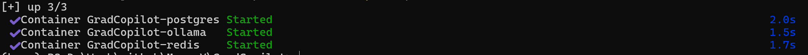

> docker常用指令：
>
> - 查看运行状态：`docker-compose ps`
> - 关闭容器：`docker-compose down`

**⚠️ 注意：数据库首次启动后，必须执行迁移脚本初始化表结构：**
```bash
python migrations/run_migration.py
```

### 3. 启动应用服务

基础设施就绪后，您可以分别拉起项目的后端核心与交互前端：

**步骤 1：启动后端业务 API**

```bash
uvicorn src.app:app --host 0.0.0.0 --port 8000
```
> 后端启动后，请访问 `http://localhost:8000/docs` 查看并测试由 FastAPI 自动生成的 OpenAPI 接口规范。

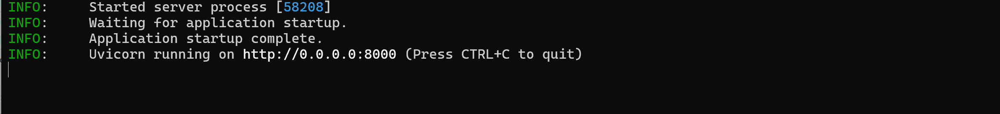

**步骤 2：启动前端应用 (二选一)**

*选项 A：终端开发客户端 (CLI)*

```bash
# 开启全新终端窗口执行
python src/cli.py
```

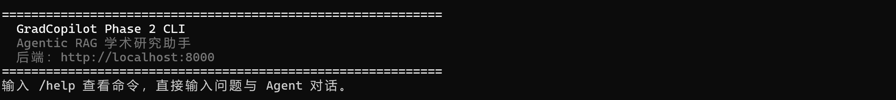

*选项 B：Web UI*

```bash
# 开启全新终端窗口执行
streamlit run streamlit_app.py
```

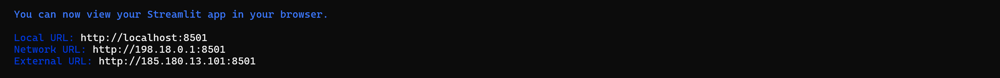

---

## 📸 工程运行演示

### 🖥️ 终端 CLI 交互效果
针对全栈开发者的调试与沉浸式体验打造的交互式终端，实时反馈各层工具调用状态与底层数据流向。

**通过 /help 查看支持命令**

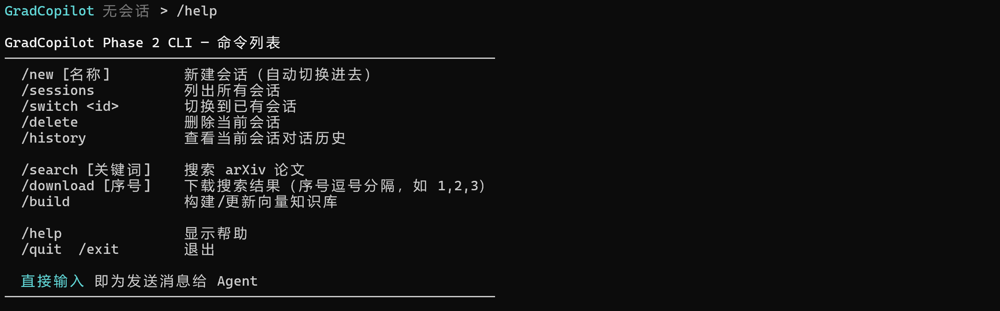

**通过 /session 查看会话列表**

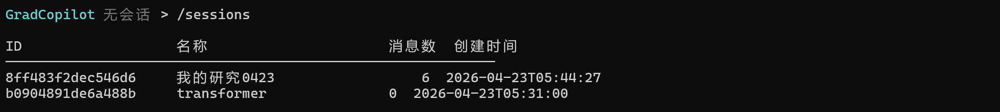

**切换会话 & 查看历史消息**

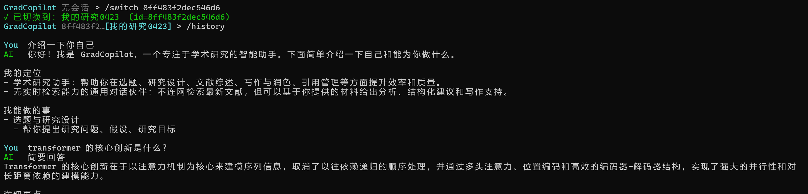

**检索论文**

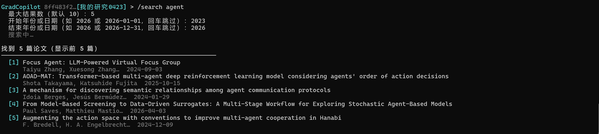

**下载论文**

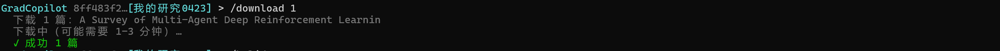

**日常操作**

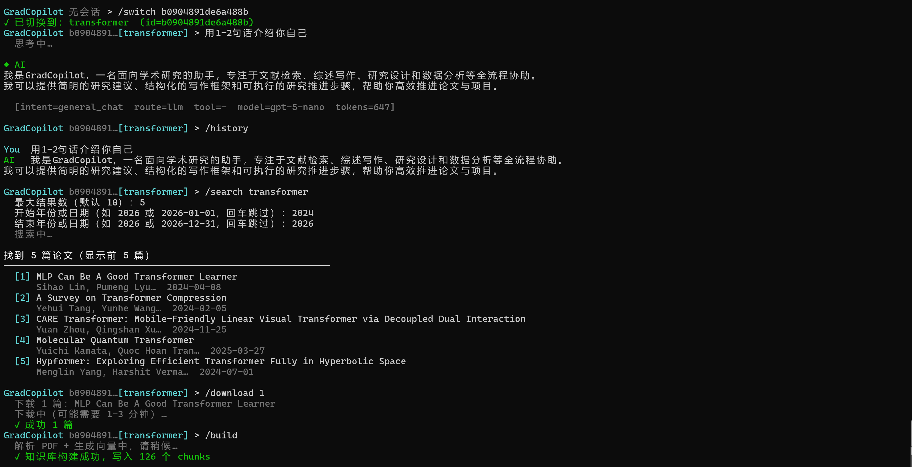

**意图识别**

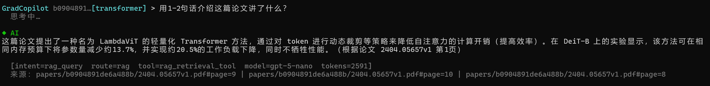

### 🌐 Streamlit Web 可视化页面

图形化操作面板，屏蔽底层 Agent 调度逻辑，提供开箱即用的体验。

**知识库管理**

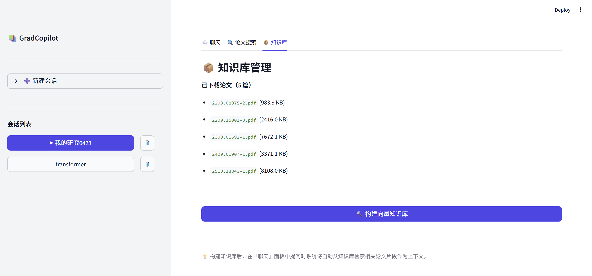

**主对话界面**  

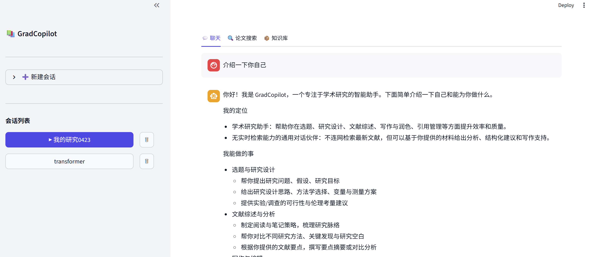

**论文检索**

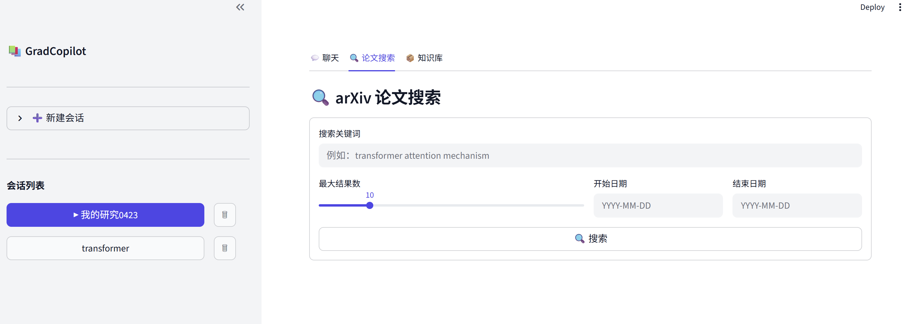


## 📄 许可证

本项目采用 **MIT 许可证**，详见 [LICENSE](./LICENSE) 文件。
