<div align="center">

# GradCopilot - 论文知识库问答系统

<p>
  
  
  
  
  
</p>

<p>
  基于 arXiv 论文的 RAG 智能问答系统 | 多会话隔离 | 模型可切换 | 前后端分离
</p>

<p>
  <a href="#快速开始">快速开始</a> •
  <a href="#功能特性">功能特性</a> •
  <a href="#项目架构">项目架构</a> •
  <a href="#运行说明">运行说明</a> •
</p>

</div>

---

## 目录

- [功能特性](#功能特性)
- [项目架构](#项目架构)
- [快速开始](#快速开始)
- [配置环境](#配置环境)
- [运行方式](#运行方式)
- [使用指南](#使用指南)
- [API 文档](#api-文档)
- [许可证](#许可证)

---

## 功能特性

<div align="center">

| 功能 | 描述 |
|------|------|
| arXiv 论文搜索 | 支持多关键词、日期筛选、排序方式 |
| 论文下载 | 一键下载选中论文到本地 |
| RAG 知识库 | 基于 FAISS 的向量检索 + LLM 问答 |
| 多会话管理 | 独立会话隔离，支持创建、重命名、删除 |
| 模型切换 | 支持 Qwen / Gemini 等多种模型 |
| UI | Streamlit 网页界面 |
| CLI 版本 | 命令行交互模式 |

</div>

---

## 项目架构

```
GradCopilot/
├── src/
│   ├── app.py              # FastAPI 后端服务
│   ├── main.py             # CLI 命令行版本
│   ├── tools/
│   │   ├── search_tool.py  # arXiv 论文搜索
│   │   ├── download_tool.py # 论文下载
│   │   └── parse_pdf_tool.py # PDF 解析
│   └── utils/
├── streamlit_app.py        # Streamlit 前端界面
├── papers/                # 下载的论文存储
├── vector_db/            # FAISS 向量数据库
├── memory/               # 会话记忆存储
│   ├── paper_memory.json
│   └── session_models.json
├── requirements.txt      # Python 依赖
└── README.md             # 本文件
```

### 技术栈

- 后端框架: FastAPI + Uvicorn
- 前端框架: Streamlit
- RAG 框架: LangChain
- 向量数据库: FAISS
- LLM 支持: Qwen, Gemini 等
- 论文来源: arXiv API

---

## 快速开始

### 前置要求

- Python 3.10+

### 步骤 1: 克隆项目

```bash
git clone https://github.com/yourusername/GradCopilot.git
cd GradCopilot
```

### 步骤 2: 安装依赖

```bash
pip install -r requirements.txt
```

### 步骤 3: 配置环境

```bash
# 复制环境变量模板
cp env.example.txt .env

# 编辑 .env 文件，填入你的 API 配置
```

### 步骤 4: 启动服务

#### 方式一: 快速启动（推荐）

```bash
# Windows
start_fastapi.bat
start_streamlit.bat

# Linux/Mac
uvicorn src.app:app --port 8000 --reload
streamlit run streamlit_app.py
```

#### 方式二: 分别启动

启动后端:
```bash
uvicorn src.app:app --port 8000 --reload
```

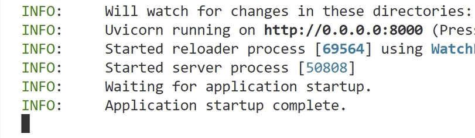

启动前端（新终端）:

```bash
streamlit run streamlit_app.py
```

### 步骤 5: 访问应用

- 前端界面: http://localhost:8501
- 后端文档: http://localhost:8000/docs

---

## 配置环境

编辑 `.env` 文件:

```env
# API 配置
API_KEY=your_api_key_here
BASE_URL=your_base_url_here
MODEL_NAME=your_model_name_here
```

<div align="center">

| 模型 | 说明 |
|------|------|
| Qwen | 阿里云通义千问 |
| Gemini | Google Gemini |
| GPT | OpenAI GPT |

</div>

---

## 运行方式

### Web 版本（推荐）

```bash
# 启动后端
uvicorn src.app:app --host 0.0.0.0 --port 8000 --reload

# 新开终端启动前端
streamlit run streamlit_app.py
```

访问 http://localhost:8501 开始使用!

**亮色模式**

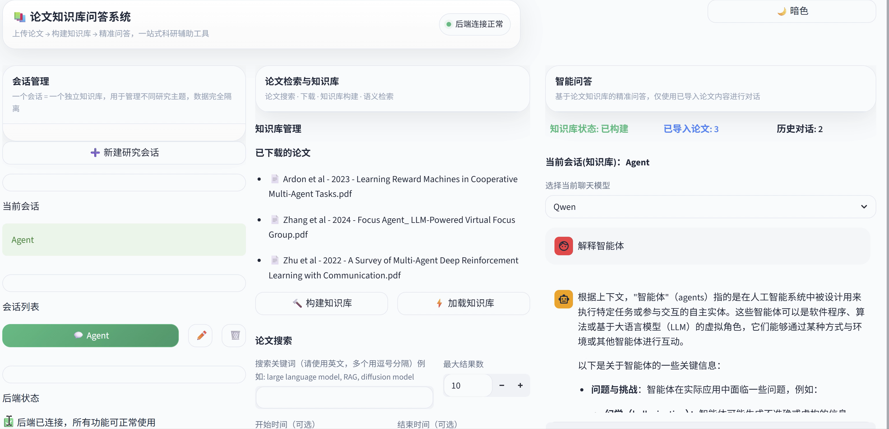

**暗色模式**

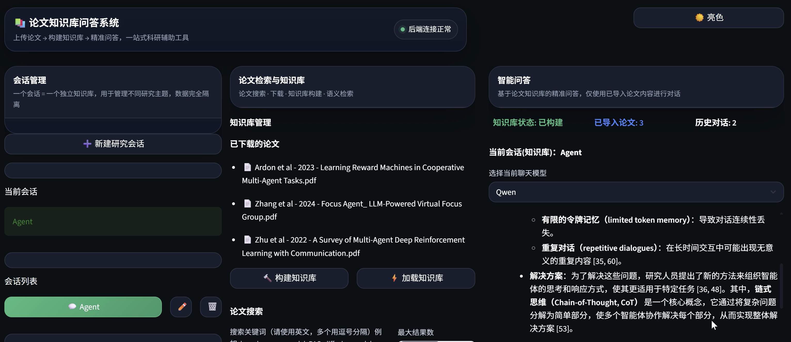

---

### CLI 版本

```bash
python src/main.py
```

按照提示输入会话 ID，开始交互问答。

---

## 使用指南

### 1. 创建会话

- 点击左侧「新建会话」
- 输入会话名称（可选）
- 点击「确定创建」

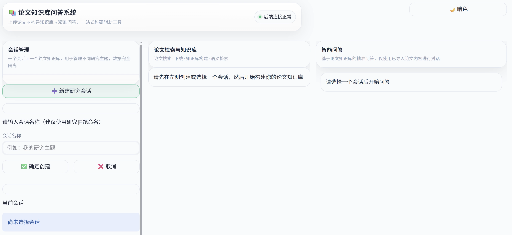

### 2. 搜索论文

- 输入搜索关键词（多个用逗号分隔）
- 设置最大结果数
- 可选: 设置日期范围
- 点击「搜索论文」

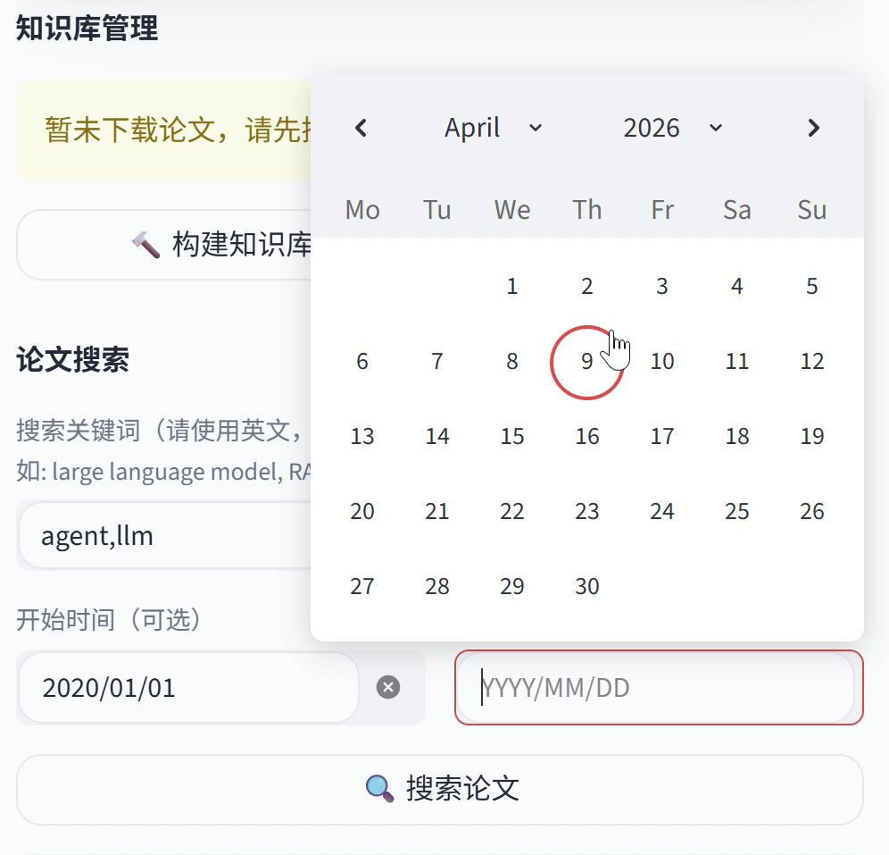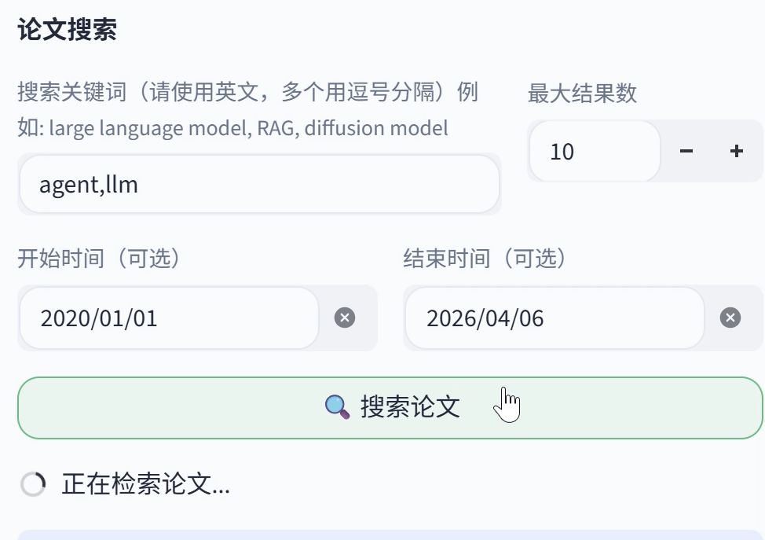

### 3. 下载论文

- 展开论文查看详情
- 勾选要下载的论文
- 点击「下载选中的论文」

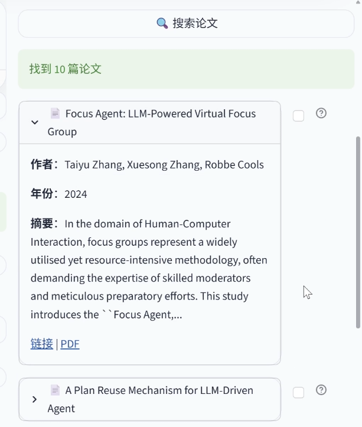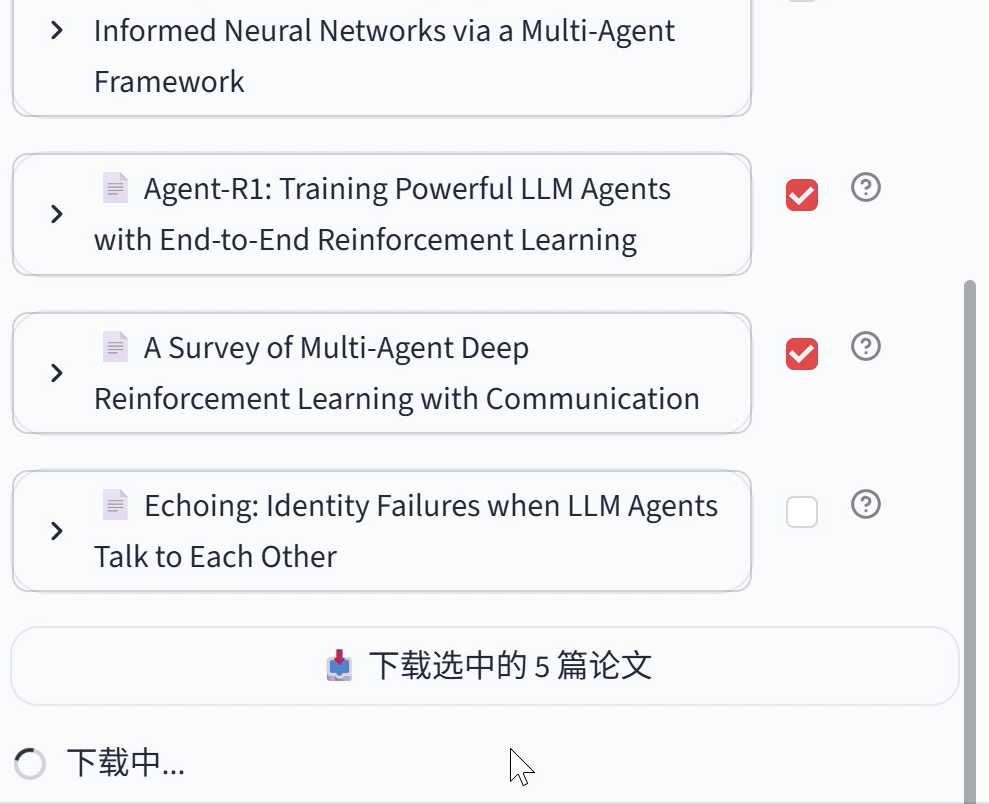

### 4. 构建知识库

- 下载论文后，点击「构建知识库」
- 自动构建并加载向量数据库

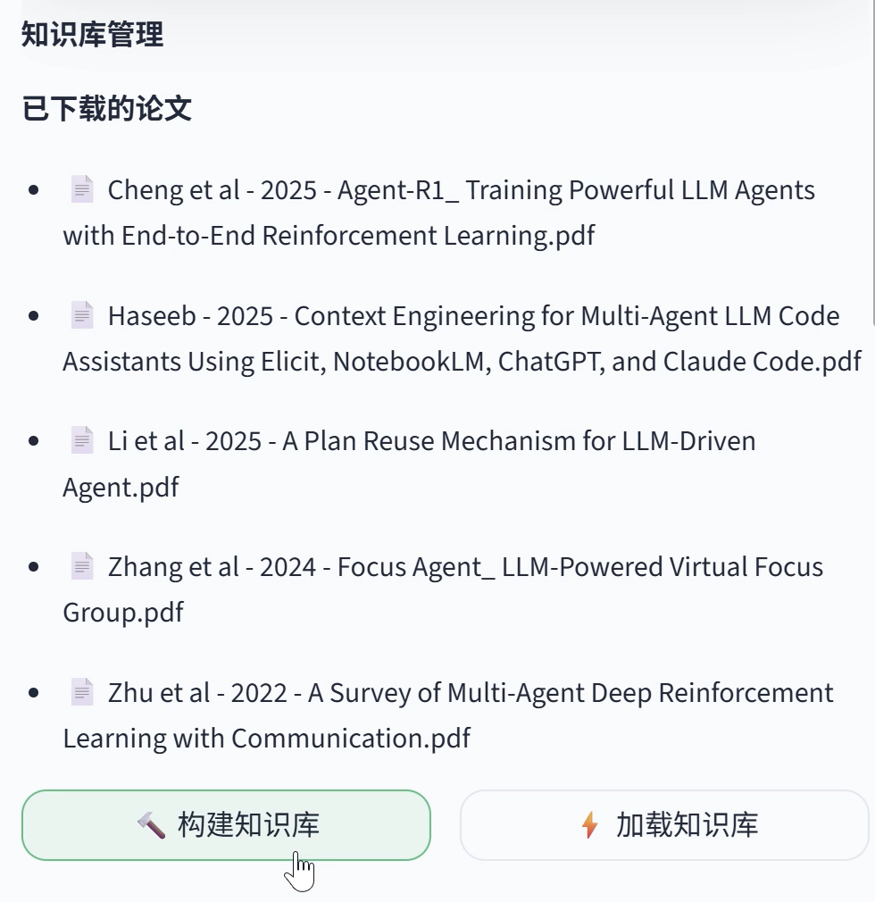

### 5. 选择模型

- 在聊天区域右上角选择模型
- 支持 Qwen / Gemini 切换

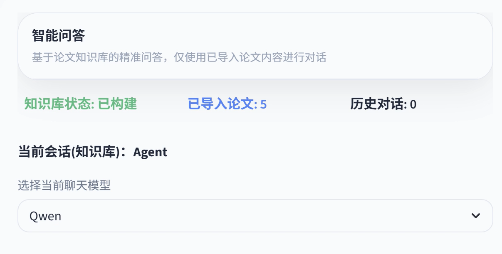

### 6. 开始问答

- 在底部输入框输入问题
- 等待 AI 回答
- 查看参考来源

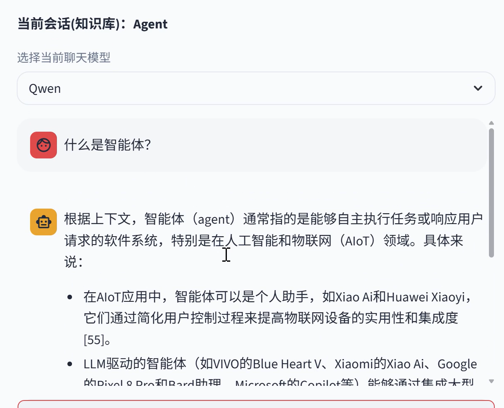

---

## API 文档

### 核心 API 端点

| 端点 | 方法 | 说明 |
|------|------|------|
| `/api/sessions` | GET | 获取所有会话列表 |
| `/api/session/info` | POST | 获取会话信息 |
| `/api/papers/search` | POST | 搜索 arXiv 论文 |
| `/api/papers/download` | POST | 下载论文 |
| `/api/knowledge/build` | POST | 构建知识库 |
| `/api/query` | POST | 查询知识库 |
| `...` | `...` | 更多接口详见 API 文档 |

---

**后端请求过程**

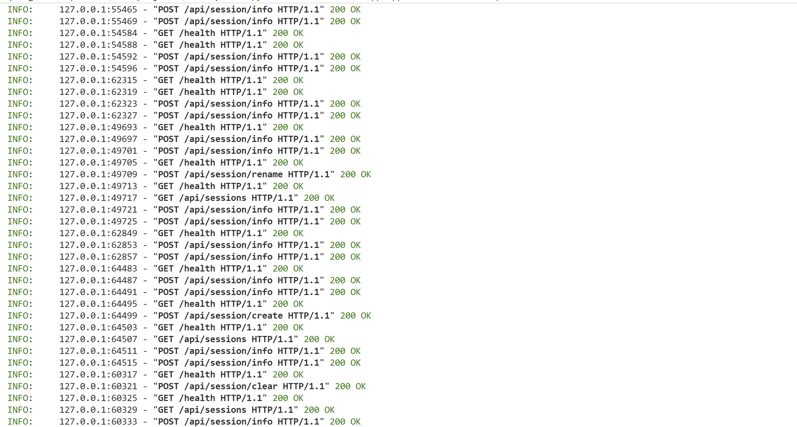

## 许可证

本项目采用 MIT 许可证 - 详见 [LICENSE](./LICENSE) 文件

---

## 贡献

欢迎提交 Issue 和 Pull Request!

---

## 联系方式

如有问题，请提交 Issue。
